- [Deepfake Detection](#deepfake-detection)
  - [1. Introduction](#1-introduction)
  - [2. Data-preprocessing & Model Selection](#2-data-preprocessing--model-selection)
    - [2.1 Parameters](#21-parameters)
      - [2.1.1 Split Ratio](#211-split-ratio)
      - [2.1.2 Selection Method](#212-selection-method)
        - [Individual Selection](#individual-selection)
        - [Group Selection](#group-selection)
      - [2.1.3 Model](#213-model)
        - [ResNet18](#resnet18)
        - [VGG16](#vgg16)
        - [InceptionV3](#inceptionv3)
    - [2.2 Image Augmentation](#22-image-augmentation)
      - [2.2.1 Resize and Center Crop](#221-resize-and-center-crop)
      - [2.2.2 Horizontal Flip](#222-horizontal-flip)
      - [2.2.3 Rotate](#223-rotate)
    - [2.3 General Settings](#23-general-settings)
    - [2.4 Primary Result](#24-primary-result)
      - [2.4.1 Best parameters](#241-best-parameters)
        - [Comparison of Split Ratio with Random Selection](#comparison-of-split-ratio-with-random-selection)
        - [Comparison of Split Ratio with Group Selection](#comparison-of-split-ratio-with-group-selection)
        - [Comparison of Random Selection with Split Ratio 8:2](#comparison-of-random-selection-with-split-ratio-82)
        - [Comparison of Split Ratio with Split Ratio 7:3](#comparison-of-split-ratio-with-split-ratio-73)
  - [3. Fine-tuning & Evaluation](#3-fine-tuning--evaluation)
    - [3.1 Leaning Rate Trick](#31-leaning-rate-trick)
      - [3.1.1 Different Learning Rates on Parameter Groups](#311-different-learning-rates-on-parameter-groups)
      - [3.1.2 Learning Rate Decay Methodology](#312-learning-rate-decay-methodology)
      - [3.1.3 Prevent Over-fitting](#313-prevent-over-fitting)
  - [4. Experiment Results](#4-experiment-results)
  - [5. Best Model Discussion & Conclusion](#5-best-model-discussion--conclusion)
    - [Results of the best model](#results-of-the-best-model)
    - [False Case Analysis](#false-case-analysis)
      - [False Positive](#false-positive)
      - [False Negative](#false-negative)
  - [References](#references)

# Deepfake Detection
The dataset and details of the project can be found [here](https://www.kaggle.com/c/cs4487-course-project/overview)
## 1. Introduction

Due to the rise of deep learning technology, there has been a dramatic increase in the realism of fake content. Those fake images can be further divided into `face_to_face` fake images and `deepfake` images. The `face_to_face` fake images are typically generated by transforming facial expression from a source to a target, while modern deepfake images are usually produced by Generative Adversarial Networks. If we cannot accurately distinguish those fake facial images from real faces, someone may manipulate deepfake images for illegal use. Thus, the DeepFake Detection has become a hot spot of research.

In this course project, we are given three channel facial images in **299 \* 299** size as inputs, and the desired output is a binary label indicating a specific image is fake or not. The entire training set consists **12,000** images, given label `f2f_fake, deep_fake`, and `real` respectively. If we generalize the `f2f_fake` and `deep_fake` as fake images, the ratio of fake images to real images is **2 to 1**.

And the test dataset consists of **2,985** unseen images. The objective we want to achieve is to train a representative model on the entire training set and acquire test accuracy as high as possible on the test set.

In face of such typical image classification problem, it is natural to think of the cutting-edge solution, which is the deep neutral network. And there are numerous different network models available in the last decades, some of them have achieved state-of-the-art performance on image classification task. Our team has chosen a few famous network models and tested their performance separately.

## 2. Data-preprocessing & Model Selection

In this section, we illustrate how we do data preprocessing and select the primary model. We take the following parameters into consideration.

### 2.1 Parameters

The overview of the parameters we considered is

|  Parameter Name  |         Options          |
| :--------------: | :----------------------: |
|   Split Ratio    |         ``` 7:3          \| 8:2 ```             |
| Selection Method | ``` Individual Selection \| Group Selection ``` |
|      Model       |       ```ResNet18        \| VGG16               \| InceptionV3 ``` |

#### 2.1.1 Split Ratio

> **Training Set**: Data set used during the learning process and is used to fit the parameters
> **Validation set**: Data set used to tune the hyperparameter

We split the dataset into **Training Set** and **Validation Set**, based on the table below, we only take **_7:3_** and **_8:2_** into consideration.

| Training : Validation |          Feasible?          |  Chosen?  |
| :-------------------: | :-------------------------: | :-------: |
|          ...          |             ...             |    ...    |
|          6:4          |  Training Set is too small  | **False** |
|          7:3          |          Feasible           | **True**  |
|          8:2          |          Feasible           | **True**  |
|          9:1          | Validation Set is too small | **False** |

#### 2.1.2 Selection Method

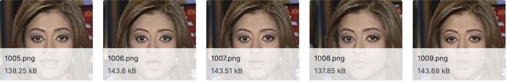

After scrutinizing the dataset, it is noticeable that **five consecutive images** have the same origin. Naturally, we come up with two different selection ways to do random selection.

##### Individual Selection

All images are randomly selected with **1** per unit. An example of 10 images selected is shown below:

```python
  dir = fake_deepfake
  idx = [3336, 2425, 3868, 1944, 1367, 3272, 369, 1257, 3716, 3864]
```

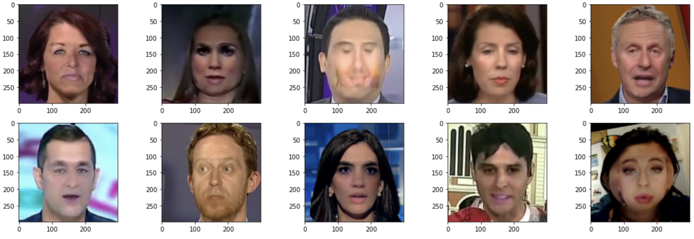

##### Group Selection

All images all randomly selected with **5** per unit, starting with **0 or 5**. An example of 10 images selected is shown below:

```python
  dir = fake_deepfake
  idx = [170,171,172,173,174,680,681,682,683,684]
```

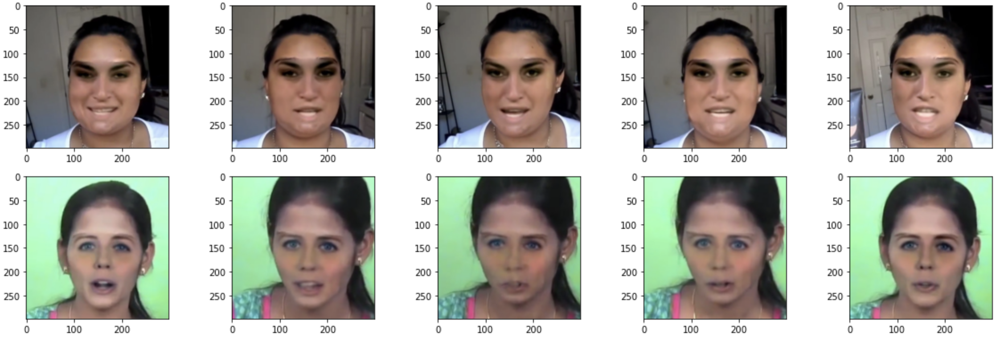

#### 2.1.3 Model

We analyse the following three networks: **ResNet18, VGG16, and InceptionV3**.

##### ResNet18

> A residual neural network (ResNet) is a type of artificial neural network (ANN) that is based on pyramidal cell constructions in the cerebral cortex.


<center>

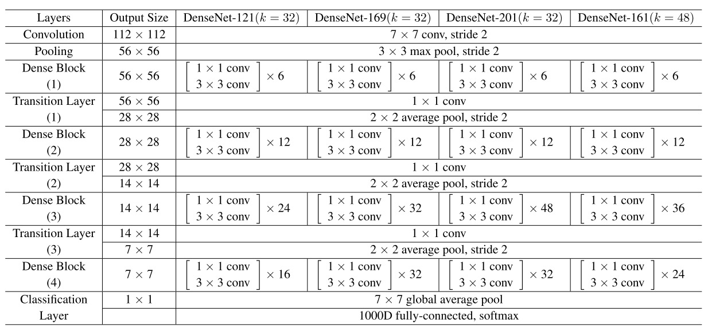

</center>

##### VGG16

> K. Simonyan and A. Zisserman proposed the VGG16 convolutional neural network model. In ImageNet, it gets a top-five test accuracy of 92.7 percent.

The architecture is shown below:

<center>

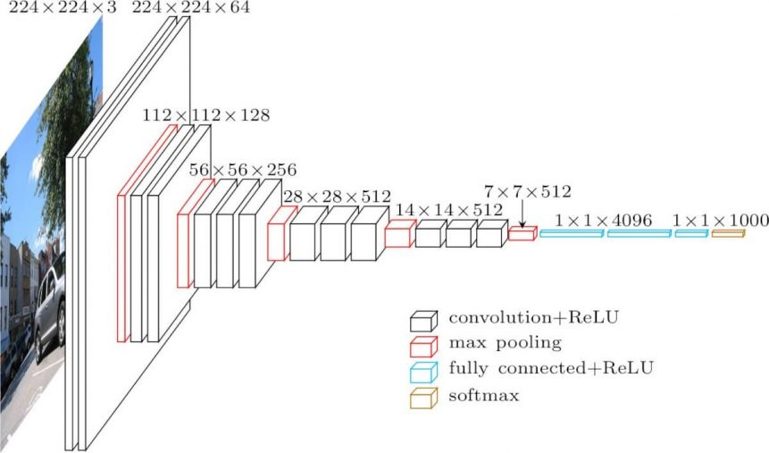

</center>

##### InceptionV3

> Inception v3 is a convolutional neural network that can help in object recognition and picture analysis. InceptionV3 was created with the goal of allowing deeper networks while keeping the amount of parameters under control: it contains "under 25 million parameters," compared to 60 million for AlexNet.

<center>


</center>

> Due to the 42 layers, the computational cost is only roughly 2.5 times that of GoogLeNet, and significantly less than that of VGGNet.

### 2.2 Image Augmentation

The whole image transform process for **InceptionV3** is shown below:

```python
train_transform = transforms.Compose([
    transforms.Resize(299),
    transforms.CenterCrop(299),
    transforms.RandomHorizontalFlip(p=0.5),
    transforms.RandomRotation(degrees=10, expand=False, fill=None),
    transforms.ToTensor(), # range [0, 255] -> [0.0,1.0]
    transforms.Normalize([0.485, 0.456, 0.406], [0.229, 0.224, 0.225]) # from official  documentation
])
```

#### 2.2.1 Resize and Center Crop

We do resize and center crop to feed corresponding images to the models.

```python
  # inceptionV3
  transforms.Resize(299),
  transforms.CenterCrop(299),

  # ResNet18
  transforms.Resize(256),
  transforms.CenterCrop(224),

  # VGG16
  transforms.Resize(256),
  transforms.CenterCrop(224),
```

<div class = 'div_center'>
  <div class = 'fx'>
  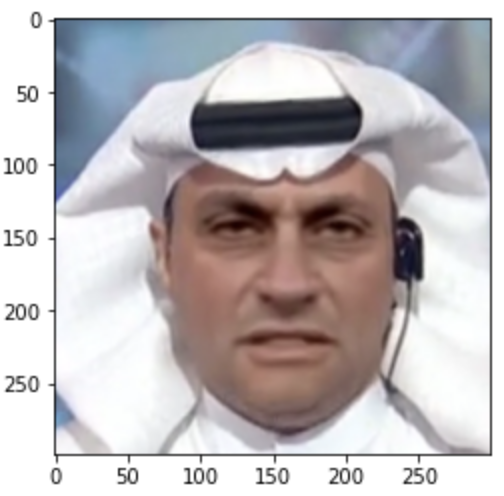
  
  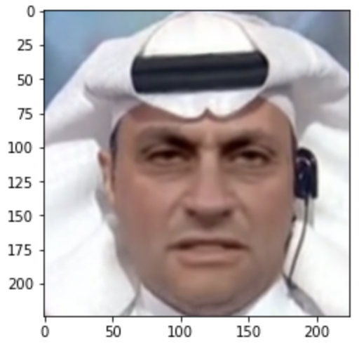
  </div>
</div>

#### 2.2.2 Horizontal Flip

Each image will have 50% to be flipped horizontally.

```python
   transforms.RandomHorizontalFlip(p=0.5) # p=0.5 -> 50% chance to flip
```

<div class = 'div_center'>
  <div class = 'fx'>
  
  
  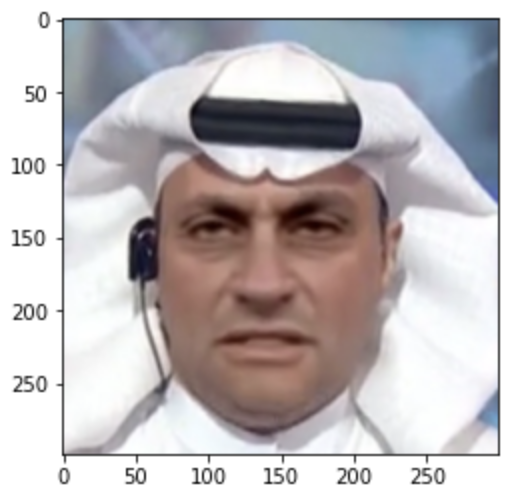
  </div>
</div>

#### 2.2.3 Rotate

Each image will to be rotated between 0-10 degrees randomly.

```python
   transforms.RandomRotation(degrees=10, expand=False, fill=None) # degrees=10 -> rotate between 0-10 degrees randomly
```

<div class = 'div_center'>
  <div class = 'fx'>
  
  
  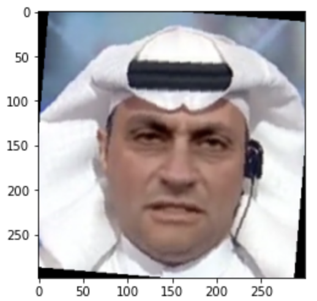
  </div>
</div>

### 2.3 General Settings

|     Name      |                                  Value                                   |
| :-----------: | :----------------------------------------------------------------------: |
| Loss Function |                               CrossEntropy                               |
| Learning rate |                                0.001 / 10                                |
|   Optimizer   |                                   Adam                                   |
|    Epochs     |                                    20                                    |
| Pre-trained?  |                       Pre-trained on **ImageNet**                        |
|  Batch Size   |                                    64                                    |
|   Shuffled?   |                                   True                                   |
| Softmax Layer | ~~1\*1\*1000(1000 classes)~~ =>1\*1\*2 (Adjust to binary classification) |

```python
criterion = nn.CrossEntropyLoss()
lr = 0.001 / 10
fc_params = list(map(id, network.fc.parameters()))
base_params = filter(lambda p: id(p) not in fc_params, network.parameters())
optimizer = optim.Adam([
            {'params': base_params},
            {'params': network.fc.parameters(), 'lr': lr * 10}],
            lr=lr, betas=(0.9, 0.999))
```

### 2.4 Primary Result

#### 2.4.1 Best parameters

Based on the above settings, the best parameters are:

|    Parameter     |       Value        |
| :--------------: | :----------------: |
|   Split Ratio    |       `8:2`        |
| Selection Method | `Random Selection` |
|      Model       |   `InceptionV3`    |

The details of results are shown below:

##### Comparison of Split Ratio with Random Selection

`8:2` outperform `7:3`

<center>

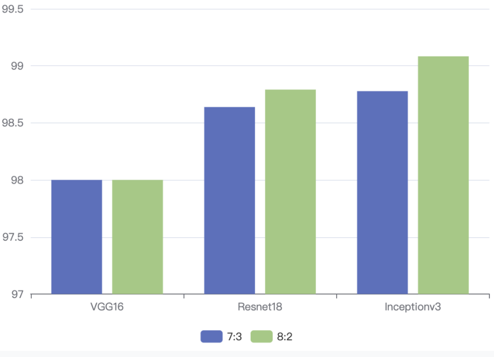

</center>

##### Comparison of Split Ratio with Group Selection

`8:2` outperform `7:3`

<center>

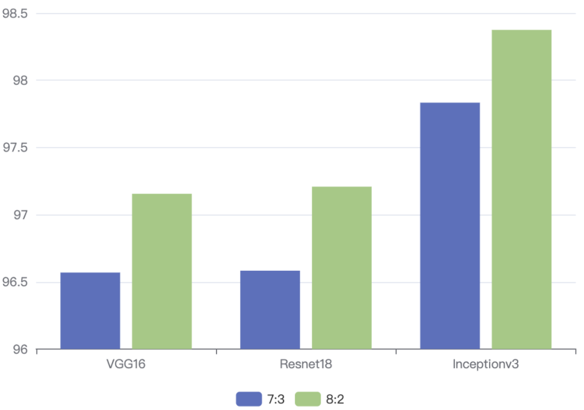

</center>

##### Comparison of Random Selection with Split Ratio 8:2

`Random Selection` outperform `Group Selection`

<center>

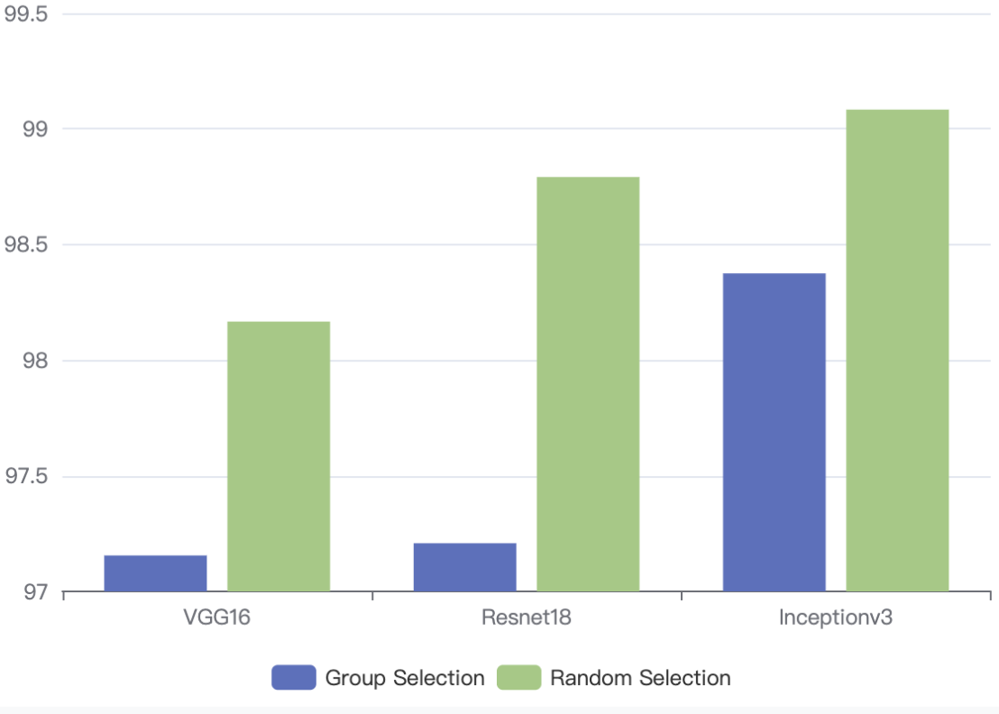

</center>

##### Comparison of Split Ratio with Split Ratio 7:3

`Random Selection` outperform `Group Selection`

<center>

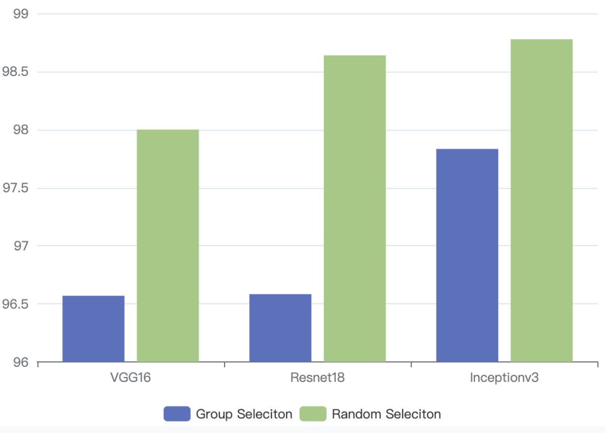

</center>

## 3. Fine-tuning & Evaluation

As illustrated in the previous section, we have finalized the primary model as follows:

<div align='center'>

| Network      | Dataset Split Method | Split Ratio (train : val) |
| ------------ | -------------------- | ------------------------- |
| Inception_v3 | Random Split         | 8 : 2                     |

</div>

And in this section, we will continue to investigate several hyperparameter and tricks in detail to further fine-tune this primary model.

### 3.1 Leaning Rate Trick

#### 3.1.1 Different Learning Rates on Parameter Groups

Deciding the learning rate is crucial for the training process.

<div align='center'>
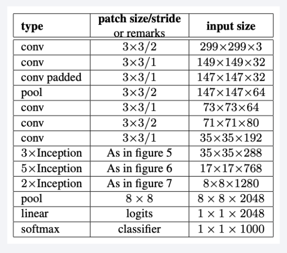

_Figure 3.1.1.a Inception_v3 Architecture_

_Retrieved from: https://pytorch.org/hub/pytorch_vision_inception_v3/_

</div>

The above figure demonstrates the detailed architecture of the `Inception_v3` model. As the model is pre-trained on ImageNet except for the last `fc` layer which is used for classification task, this gives the intuition on our operation on the learning rate. Since we substitute the pre-trained softmax layer with an untrained `fc` layer, all weights associated with the modified fc layer need to be retrained from scratch. Therefore, it requires larger learning rate. On the contrary, the weights used in middle layers that are well-trained on ImageNet only require minor update, so they use smaller learning rate. We choose the initial learning rate of the fc layer to be **0.001** while the initial learning rate for weights in other layers to be **0.0001** at this step.

Then we trained a model to illustrate our ideas. The training loss as well as the accuracies figures are as follows:

<div align='center'>
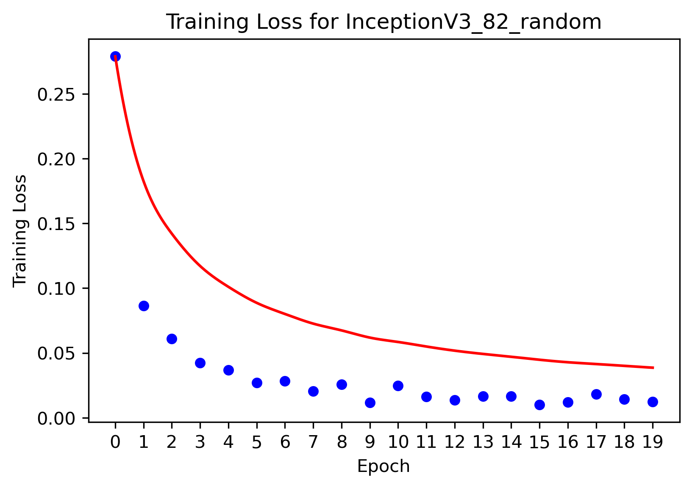
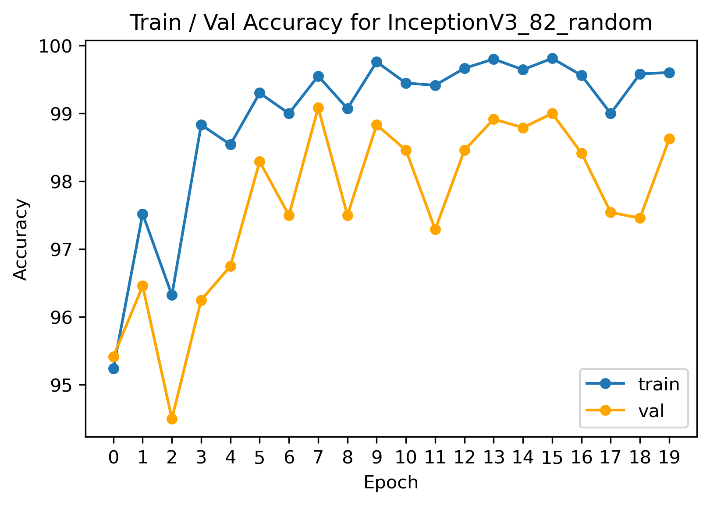

_Figure 3.1.1.b InceptionV3_82_random Accuracy and Training Loss Plots_

</div>

However, the curves in two graphs are far from optimal. We can identify potential drawbacks:

- When approaching global optimal, high learning rate may make the model difficult to converge
- Relatively high learning rate may result in oscillating validation accuracy

It seems adopting fixed learning rate cannot acquire satisfying validation accuracy, so we consider move from fixed ones to dynamic learning rate.

#### 3.1.2 Learning Rate Decay Methodology

Among the learning rate decay functions provided by PyTorch, we choose `StepLR`, `ExponentialLR` and `CosineAnnealingLR` to test the model performance. The common settings of hyperparameter are: `step_size = 5, gamma = 0.5`.

After taking the gap between training accuracy and validation accuracy as well as the smoothness of the accuracy curve into consideration, we finally choose the model utilizing `StepLR` learning rate decay and the performance is illustrated as follows:

<div align='center'>
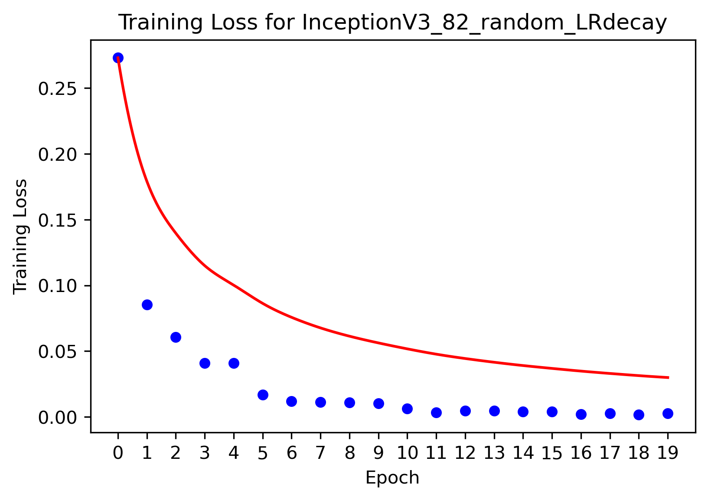
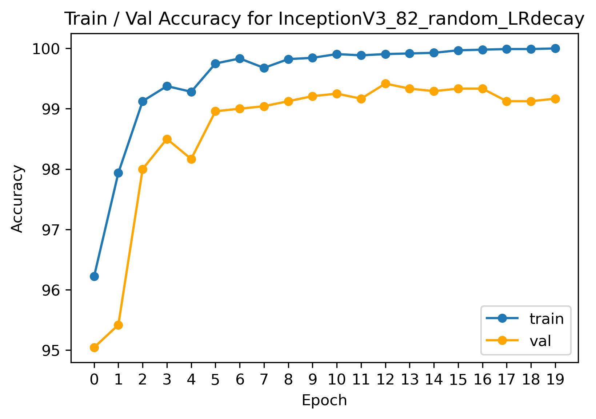

_Figure 3.1.2.a InceptionV3_82_random_LRdecay Accuracy and Training Loss Plots_

</div>

The above results seems promising, but after looking into the plots of other two models that employ `ExponentialLR` and `CosineAnnealingLR` respectively, an important phenomenon comes to our attention. We find the validation accuracy of their plots start to decrease when reaching the end of the training process, which is an indication of over-fitting.

#### 3.1.3 Prevent Over-fitting

To come up with ideas to prevent over-fitting, we add an L2 Regularization term to the original cross-entropy loss function.

In the setup of optimizer in PyTorch, there is a hyperparameter called **weight_decay**, and this term is equivalent to the regularization penalty. By default, the weight_decay is set to 0. At current stage, we set ` weight_decay = 10^(-4)`. Here are the training results:

<div align='center'>
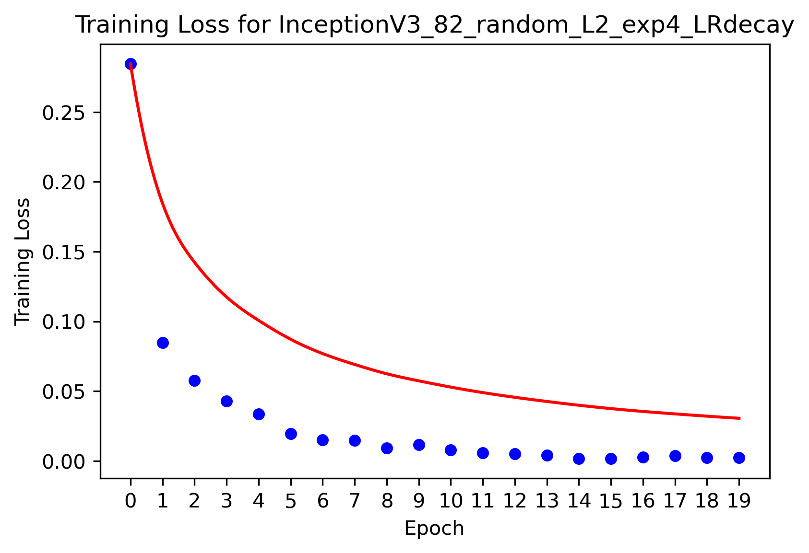
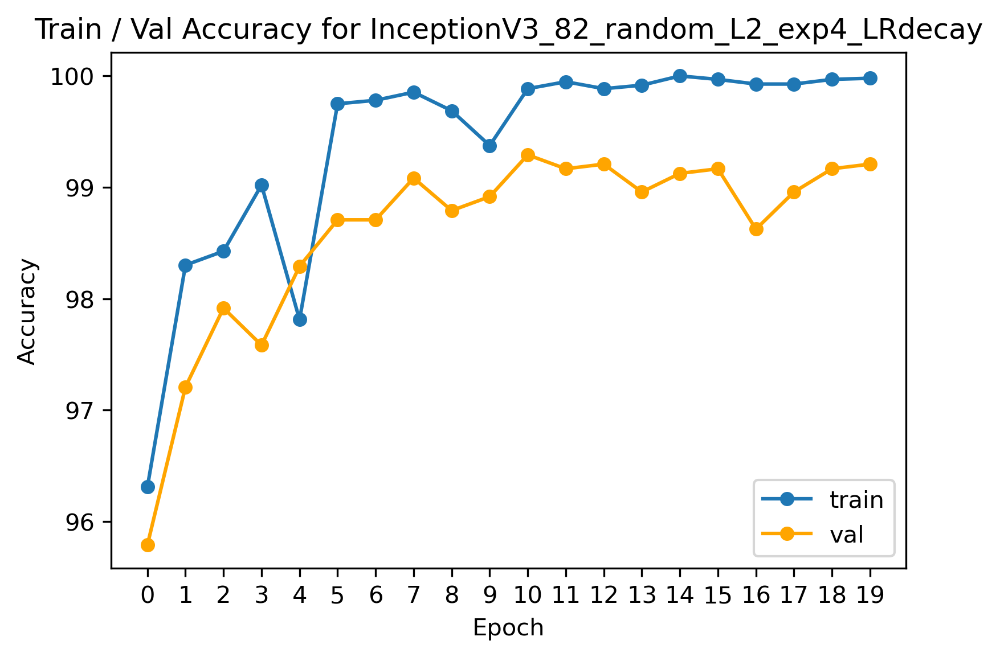

_Figure 3.1.3.b InceptionV3_82_random_L2_exp-4_LRdecay Accuracy and Training Loss Plots_

</div>

Compared with plots without L2 regularization technique, we find that adding a regularization term to the loss function will cause the accuracy curves to fluctuate a bit more violently. And the gap between the training accuracy curve and the val accuracy curve has been increased on average, which is an indication of lower chance of over-fitting.

To sum up, we have tried learning rate trick, learning rate decay function, and L2 regularization in this section to help our model perform better. And all those methods are proved to be efficient in our previous experiments. Then in the next section, we will further adopt those methods to carry out a comprehensive experiment to find the model that achieves the highest validation accuracy.

## 4. Experiment Results

Based on the previous analyses, we have proved the feasibility to add following common settings to table in section [2.3](#23-general-settings) for our further experiments:

|    Parameter     |       Value        |
| :--------------: | :----------------: |
|   Split Ratio    |       `8:2`        |
| Selection Method | `Random Selection` |
|      Model       |   `InceptionV3`    |
| StepLR step_size |        `5`         |
|   StepLR gamma   |      `0.005`       |
|  Training Epoch  |        `20`        |

Then based on the above settings, we have carried out the following experiments, and display their accuracy on the **validation set**:

<div class = "hlt">

|                       Name                       |                    lr                    | weight_decay | Best_epoch | Best_validation_acc |
| :----------------------------------------------: | :--------------------------------------: | :----------: | :--------: | :-----------: |
|                     Baseline                     | `fc_params: 0.001, base_params: 0.0001 ` |      0       |     7      |   0.990833    |
|                Baseline + StepLR                 | `fc_params: 0.001, base_params: 0.0001 ` |      0       |     12     |   0.994167    |
|                  Baseline + L2                   | `fc_params: 0.001, base_params: 0.0001 ` |  $10^{-2}$   |     15     |   0.985833    |
|        Baseline + L2 ($10^{-2}$) + StepLR        | `fc_params: 0.001, base_params: 0.0001 ` |  $10^{-2}$   |     17     |   0.993333    |
|        Baseline + L2 ($10^{-3}$) + StepLR        | `fc_params: 0.001, base_params: 0.0001 ` |  $10^{-3}$   |     17     |   0.993333    |
|        Baseline + L2 ($10^{-4}$) + StepLR        | `fc_params: 0.001 base_params: 0.0001 `  |  $10^{-4}$   |     10     |   0.992917    |
| Baseline + L2 (($10^{-3}$) + StepLR + lr (0.005) | `fc_params: 0.005 base_params: 0.0005 `  |  $10^{-3}$   |     12     |   0.992083    |
| Baseline + L2 (($10^{-4}$) + StepLR + lr (0.005) | `fc_params: 0.005 base_params: 0.0005 `  |  $10^{-4}$   |     17     |   0.993333    |
| Baseline + L2 ($10^{-3}$) + StepLR + lr (0.008)  | `fc_params: 0.008 base_params: 0.0008 `  |  $10^{-3}$   |     10     |   0.985417    |
| Baseline + L2 ($10^{-4}$) + StepLR + lr (0.008)  | `fc_params: 0.008 base_params: 0.0008 `  |  $10^{-4}$   |     17     |     0.9875      |

</div>

Since we regard all models with ```acc > 0.99``` as overfit. The best model we selected is the last one in the table. The training loss and accuracy plots are displayed below:

<div align='center'>
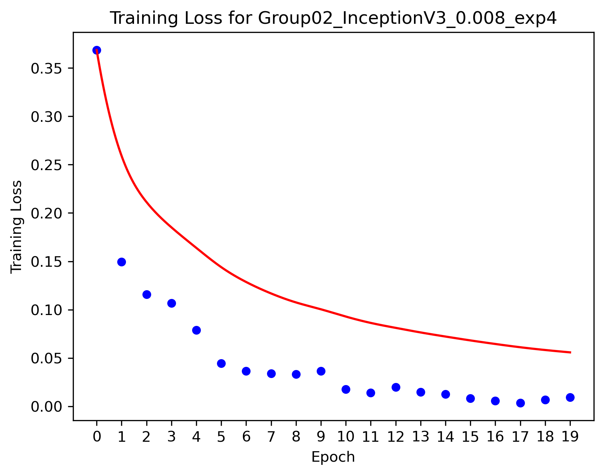
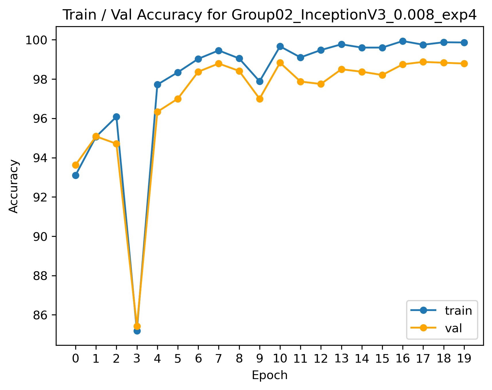

_Figure 4 Baseline + L2 ($10^{-4}$) + StepLR + lr (0.008) Accuracy and Training Loss Plots_

</div>

As we can see from the plots, the training accuracy and validation accuracy are all converged.

## 5. Best Model Discussion & Conclusion

### Results of the best model

The best model selected is `Baseline + L2 (10^-4) + StepLR + lr (0.008)`, the performance on the **validation set** is :

| Accuracy | Recall | Precision |
| :------: | :----: | :-------: |
|  0.9875  | 0.9763 |  0.9861   |

### False Case Analysis

In this section, we analysis false cases of our best model.

#### False Positive

The following images are labeled `False Positive`. An obvious character for most of them is that their eyes are not clear enough. An another observation is that some of them are blurred or dimmed.

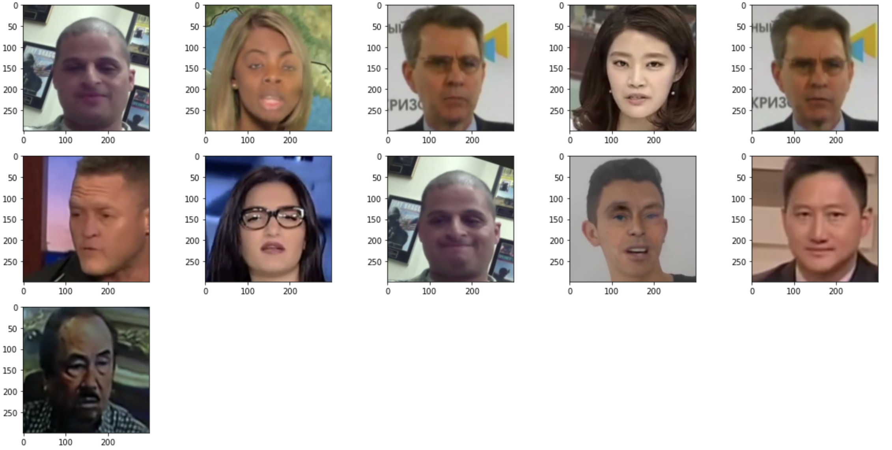

#### False Negative

The following images are labeled `False Negative`. The most obvious character is that their mouths are open. And some images are dimmed and blurred.

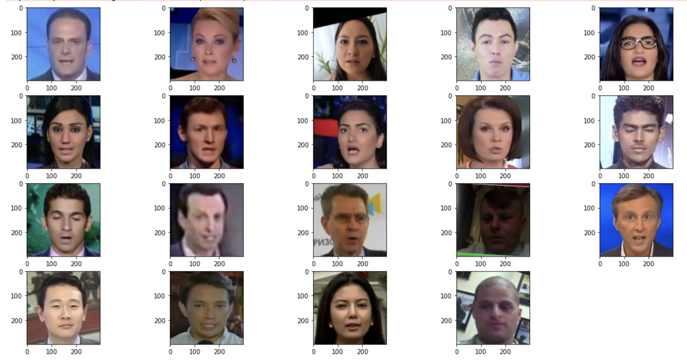

## References 
- CS4487 course project. Kaggle. (n.d.). Retrieved November 24, 2021, from https://www.kaggle.com/c/cs4487-course-project/data. 

- He, K., Zhang, X., Ren, S., & Sun, J. (2016). Deep residual learning for image recognition. In Proceedings of the IEEE conference on computer vision and pattern recognition (pp. 770-778).

- J. Deng, W. Dong, R. Socher, L. Li, Kai Li and Li Fei-Fei, "ImageNet: A large-scale hierarchical image database," 2009 IEEE Conference on Computer Vision and Pattern Recognition, 2009, pp. 248-255, doi: 10.1109/CVPR.2009.5206848.
- Lecture Notes, CS4487 Machine Learning, Dept. of CS, City University of Hong Kong
- PyTorch 1.10.0 documentation. (n.d.). Retrieved November 24, 2021, from https://pytorch.org/docs/stable/index.html. 
  
- Simonyan, K., & Zisserman, A. (2014). Very deep convolutional networks for large-scale image recognition. arXiv preprint arXiv:1409.1556.

- Szegedy, C., Liu, W., Jia, Y., Sermanet, P., Reed, S., Anguelov, D., ... & Rabinovich, A. (2015). Going deeper with convolutions. In Proceedings of the IEEE conference on computer vision and pattern recognition (pp. 1-9).
